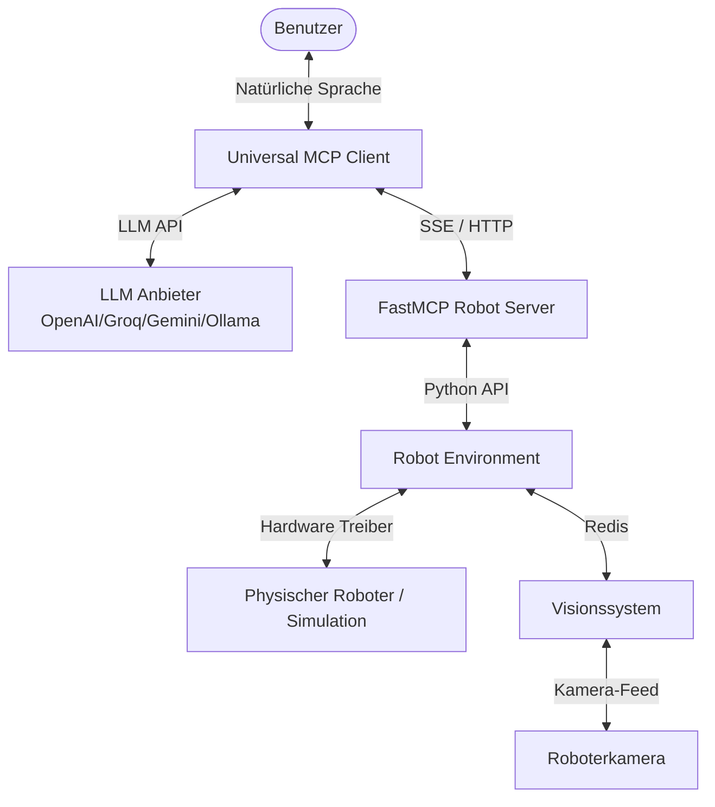
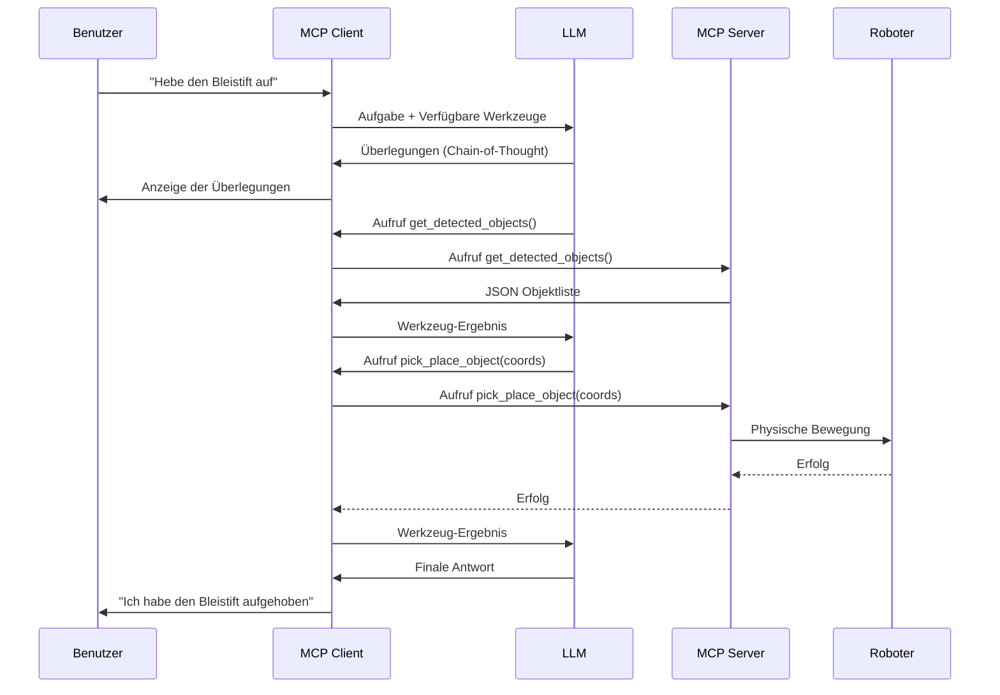

# Systemarchitektur

Das Robot MCP-System basiert auf einer modularen Architektur, die die LLM-Logik, die MCP-Kommunikationsschicht und die physische Robotersteuerung voneinander trennt.

## Systemübersicht

## Datenfluss

