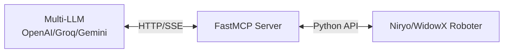

# Robot MCP Dokumentation

Willkommen zur Robot MCP Dokumentation!

Steuern Sie Roboterarme durch natürliche Sprache mit FastMCP und mehreren LLM-Anbietern (OpenAI, Groq, Gemini, Ollama).

## 🎯 Schnelleinstieg

-   :material-clock-fast:{ .lg .middle } __Schnellstart__

    ---

    Starten Sie in wenigen Minuten mit unserem Schnellstart-Leitfaden.

    [:octicons-arrow-right-24: Installation](installation.md)

-   :material-book-open-variant:{ .lg .middle } __Benutzerhandbuch__

    ---

    Lernen Sie, wie Sie Robot MCP effektiv einsetzen.

    [:octicons-arrow-right-24: Setup-Leitfaden](getting-started.md)

-   :material-code-braces:{ .lg .middle } __API-Referenz__

    ---

    Vollständige API-Dokumentation für alle Werkzeuge.

    [:octicons-arrow-right-24: API-Referenz](api/index.md)

-   :material-package-variant:{ .lg .middle } __Beispiele__

    ---

    Praxisbeispiele und Anwendungsfälle.

    [:octicons-arrow-right-24: Beispiele](examples.md)

## Funktionen

✨ **Natürliche Sprachsteuerung** - Keine Programmierung erforderlich
🤖 **Multi-LLM-Unterstützung** - OpenAI, Groq, Gemini, Ollama
🎯 **Automatische Erkennung** - Wählt automatisch verfügbare APIs aus
🔄 **Hot-Swapping** - Wechseln Sie Anbieter während der Laufzeit
🤖 **Multi-Roboter-Unterstützung** - Niryo Ned2 und WidowX
👁️ **Visionsbasierte Erkennung** - Automatische Objekterkennung

## Systemarchitektur

## Erste Schritte

1. [Paket installieren](installation.md)
2. [API-Schlüssel konfigurieren](installation.md#api-schlüssel-konfiguration)
3. [Server starten](getting-started.md#nutzungsmodi)
4. [Beispiele ausprobieren](examples.md)

## Unterstützung

- 📖 [Dokumentation](README.md)
- 🐛 [Probleme melden](https://github.com/dgaida/robot_mcp/issues)
- 💬 [Diskussionen](https://github.com/dgaida/robot_mcp/discussions)
