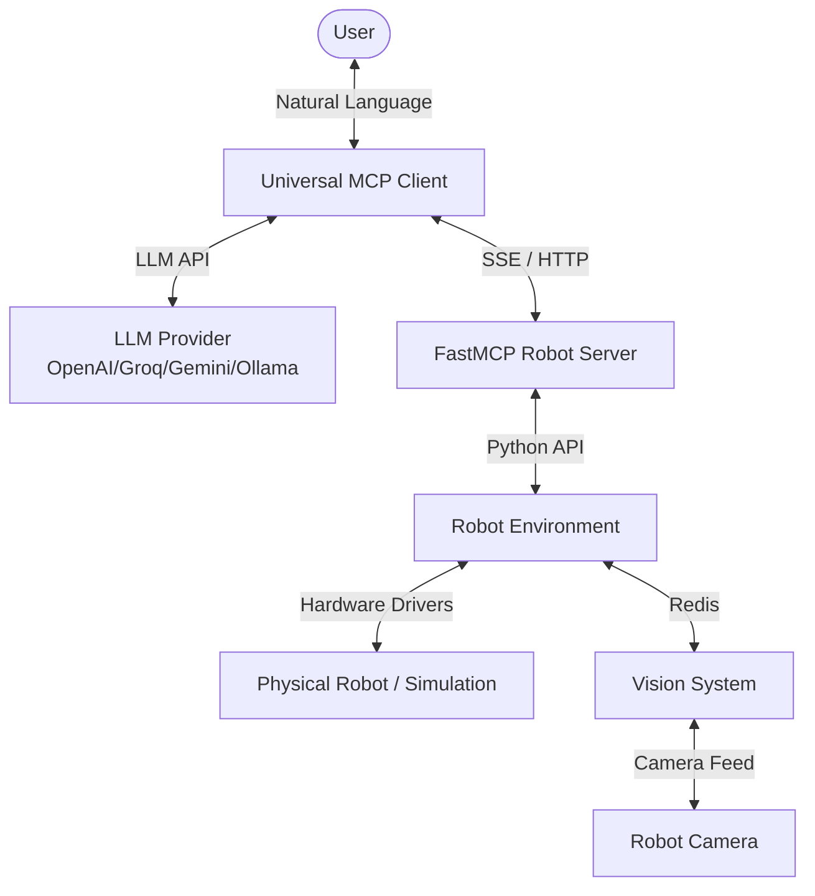
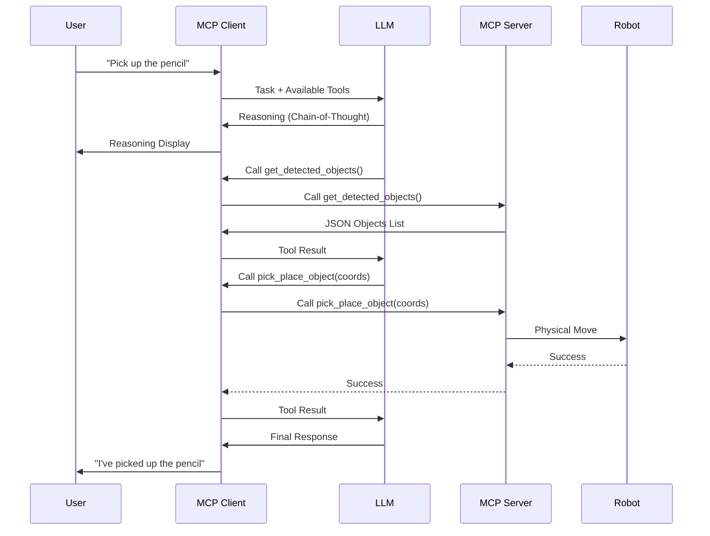

# System Architecture

The Robot MCP system is built on a modular architecture that separates the LLM reasoning, the MCP communication layer, and the physical robot control.

## System Overview

## Data Flow

