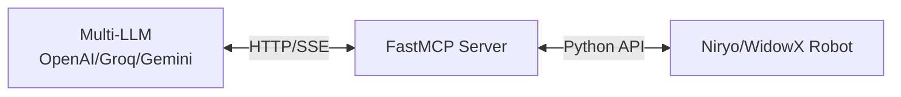

# Robot MCP Documentation

Welcome to the Robot MCP documentation!

Control robotic arms through natural language using FastMCP and multiple LLM providers (OpenAI, Groq, Gemini, Ollama).

## 🎯 Quick Links

-   :material-clock-fast:{ .lg .middle } __Quick Start__

    ---

    Get started in minutes with our quick start guide

    [:octicons-arrow-right-24: Installation](installation.md)

-   :material-book-open-variant:{ .lg .middle } __User Guide__

    ---

    Learn how to use Robot MCP effectively

    [:octicons-arrow-right-24: Getting Started](getting-started.md)

-   :material-code-braces:{ .lg .middle } __API Reference__

    ---

    Complete API documentation for all tools

    [:octicons-arrow-right-24: API Docs](api/index.md)

-   :material-package-variant:{ .lg .middle } __Examples__

    ---

    Real-world examples and use cases

    [:octicons-arrow-right-24: Examples](examples.md)

## Features

✨ **Natural Language Control** - No programming required
🤖 **Multi-LLM Support** - OpenAI, Groq, Gemini, Ollama
🎯 **Auto-Detection** - Automatically selects available API
🔄 **Hot-Swapping** - Switch providers during runtime
🤖 **Multi-Robot Support** - Niryo Ned2 and WidowX
👁️ **Vision-Based Detection** - Automatic object detection

## System Architecture

## Getting Started

1. [Install the package](installation.md)
2. [Configure API keys](installation.md#api-keys-configuration)
3. [Start the server](getting-started.md#usage-modes)
4. [Try examples](examples.md)

## Support

- 📖 [Documentation](index.md)
- 🐛 [Report Issues](https://github.com/dgaida/robot_mcp/issues)
- 💬 [Discussions](https://github.com/dgaida/robot_mcp/discussions)
